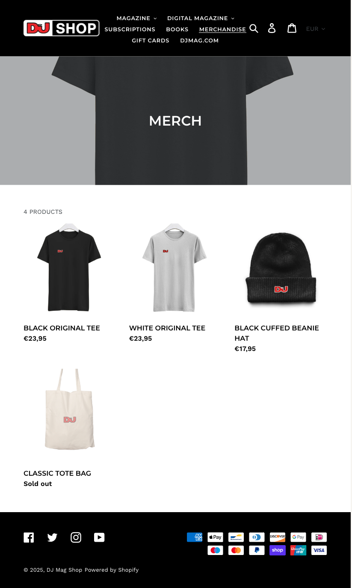
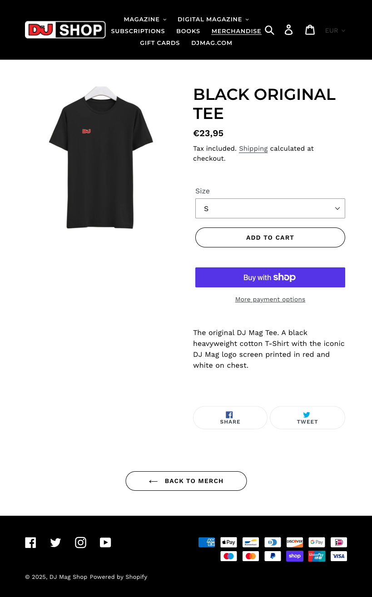
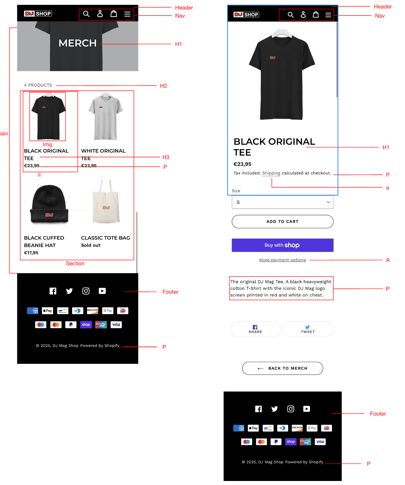
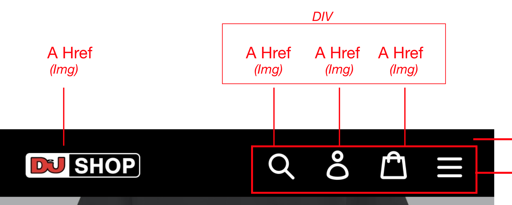
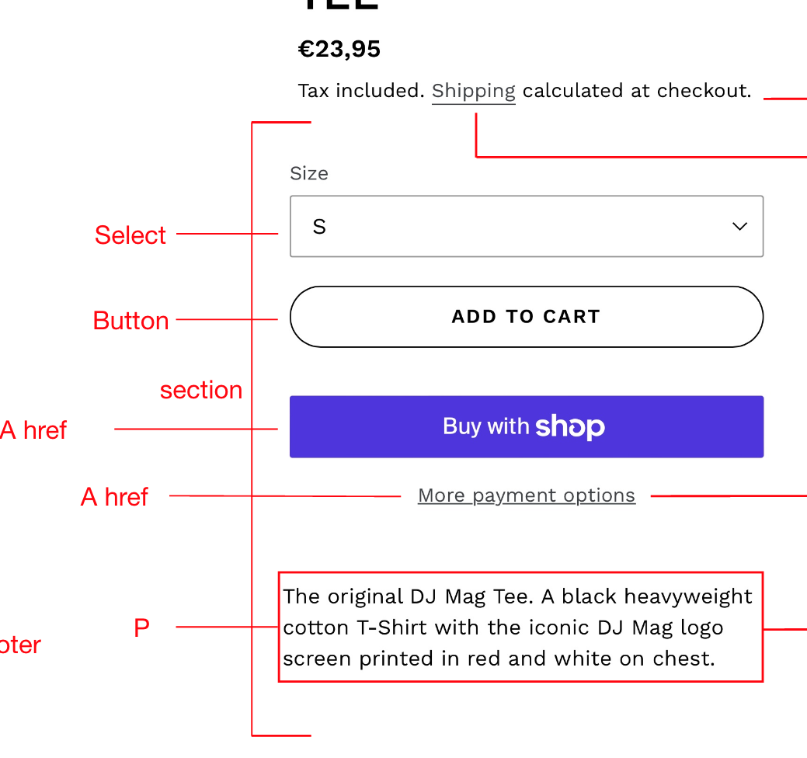
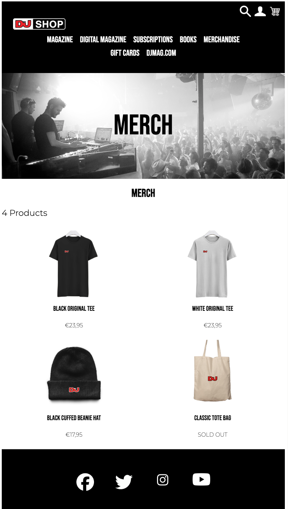
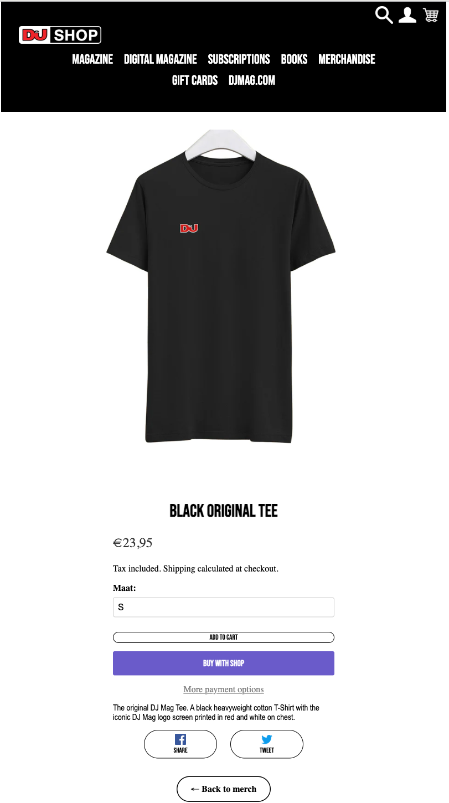
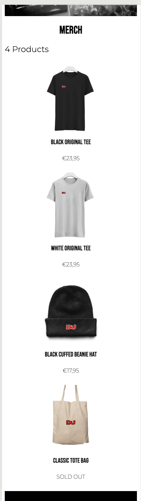
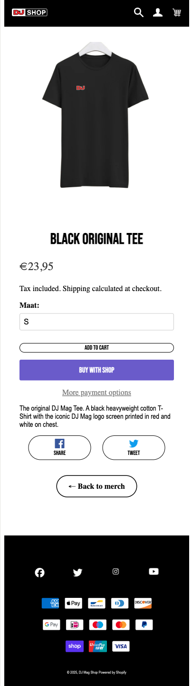

# Procesverslag
Markdown is een simpele manier om HTML te schrijven.  
Markdown cheat cheet: [Hulp bij het schrijven van Markdown](https://github.com/adam-p/markdown-here/wiki/Markdown-Cheatsheet).

Nb. De standaardstructuur en de spartaanse opmaak van de README.md zijn helemaal prima. Het gaat om de inhoud van je procesverslag. Besteedt de tijd voor pracht en praal aan je website.

Nb. Door *open* toe te voegen aan een *details* element kun je deze standaard open zetten. Fijn om dat steeds voor de relevante stuk(ken) te doen.

## Jij

  
uitwerken voor kick-off werkgroep

  ### Auteur:
  Zep Walbeek

  #### Je startniveau:
  Blauw

  #### Je focus:
  Responsive
 

## Je website

  
uitwerken voor kick-off werkgroep

  ### Je opdracht:
  https://djmagshop.com/collections/merchandise

  #### Screenshot(s) van de eerste pagina (small screen): 
  Dj Mag - Merch
  

  #### Screenshot(s) van de tweede pagina (small screen):
  Dj Mag - Products - Black Original Tee 
  
 

## Toegankelijkheidstest 1/2 (week 1)

  
uitwerken na test in 2e werkgroep

  ### Bevindingen
  Lijst met je bevindingen die in de test naar voren kwamen:
  - De focus order matched niet met de visuele layout van de site, in het navigatie-menu zijn er uitklapbare knoppen die met toetsenboord navigatie niet uitklappen waardoor je vast blijft zitten in de navigatie. 
  - Voor afbeeldingen waar tekst op staat, is er geen beschrijving (alleen voor de afbeelding zelf maar dus niet de text op de afbeelding) 
  - Er zijn geen transcripties beschikbaar voor de video's op de site. 
  - Er worden geen button elements gebruikt in de code voor knoppen op de site. 
  - Het contrast op de site is erg goed zichtbaar door het gebruikte colorpalet.

## Breakdownschets (week 1)

  
uitwerken na afloop 3e werkgroep

  ### de hele pagina: 
  

  ### dynamisch deel (bijv menu): 
  

  ### wellicht nog een dynamisch deel (bijv filter): 
  

## Voortgang 1 (week 2)

  
uitwerken voor 1e voortgang

  ### Stand van zaken
  Ik vond het aan het begin heel erg moeilijk om te kijken waar ik moest/wilde beginnen met mijn site, ik vroeg hierbij hulp aan medestudenten en de studentassistenten om zo mij te helpen met de start. Ik kreeg als tip om te beginnen met het verzamelen van content van de site en deze alvast in volgorde in de html te zetten in de juiste volgorde. Dit zorgde al voor meer overzicht en een goede start. 

  ### Agenda voor meeting
  samen met je groepje opstellen

  | student 1      | student 2          | student 3    | student 4        |
  | ---            | ---                | ---          | ---              |
  | dit bespreken  | en dit             | en ik dit    | en dan ik dat    |
  | en dat ook nog | dit als er tijd is | nog een punt | dit wil ik zeker |
  | ...            | ...                | ...          | ...              |

  ### Verslag van meeting
  hier na afloop snel de uitkomsten van de meeting vastleggen

  - De breakdownschets is niet helemaal compleet en ik heb soms de verkeerde tags gebruikt. 
  - Zorg ervoor dat je echt alle onderdelen van de site meeneemt in de breakdown schets zodat je hiermee later makkelijk aan de slag kan. 
  - Kijk goed naar welke pagina je het beste kan namaken en wat het meest realistisch en haalbaar is voor je eigen niveau, kies dus slim.
  - ...

## Voortgang 2 (week 3)

  
uitwerken voor 2e voortgang

  ### Stand van zaken
  hier dit ging goed & dit was lastig (neem ook screenshots op van delen van je website en code)

  ### Agenda voor meeting
  samen met je groepje opstellen

  | student 1      | student 2          | student 3    | student 4        |
  | ---            | ---                | ---          | ---              |
  | dit bespreken  | en dit             | en ik dit    | en dan ik dat    |
  | en dat ook nog | dit als er tijd is | nog een punt | dit wil ik zeker |
  | ...            | ...                | ...          | ...              |

  ### Verslag van meeting
  hier na afloop snel de uitkomsten van de meeting vastleggen

  - Ik ben nu de site aan het maken op groot scherm, maar aangezien je een responsive design moet maken is het veel beter om te werk te gaan op klein scherm, dit zorgt er l;ater voor dat je dit veel makkelijker kan omzetten naar groot scherm en het dus gemakkelijk responsive kan maken!
  - Ik heb een aantal onnodige tags gebruikt die niet nodig zijn, haal deze weg, ook gebruik ik veel divs terwijl dit niet nodig is. Pas dit aan. 
  - Ik loop best wel achter, aangezien ik ook veel moeite heb moet ik nog wat oefenen met de opdrachten, dit is de enige manier om de stof echt goed te kunnen beheersen. 
- ...

## Toegankelijkheidstest 2/2 (week 4)

  
uitwerken na test in 9e werkgroep

  ### Bevindingen
  - In de naviagtie worden er veel divs gebruikt, dit hoort niet, omdat het een nav is moet je list items gebruiken, (dit kan problemen veroorzaken als de screenreader wordt gebruikt?). 
  - De responsivness van de site is nog niet echt helemaal correct, gebruikt @media op de juiste manier en probeer effectief te werk te gaan en overbodige code regels weg te werken (samenvoegen). 
  - De tab functie werkt nog niet helemaal goed. 
  - De alt's zijn niet goed, omschrijf echt wat er te zien is en niet wat voor functie het heeft. 

## Voortgang 3 (week 4)

  
uitwerken voor 3e voortgang

  ### Stand van zaken
  - Probeer echt op klein scherm te werken (320), hierdoor is het vervolgens makkelijker om het voor groot scherm te ontwerpen. Je ziet nu dat als je naar groot scherm overschakelt dat het er niet meer uitziet zoals je wilt/hoort. 
  - Je wilt dat de pagina meebeweegt als het scherm kleiner wordt, nu heb je dat je een versie voor groot en klein scherm hebt maar daartussen gebeurd er niet zoveel. 
  - Probeer je code goed door te nemen en bij de alt's van links een "/" toe te voegen om zo errors te voorkomen.

  ### Agenda voor meeting
  samen met je groepje opstellen

  | student 1      | student 2          | student 3    | student 4        |
  | ---            | ---                | ---          | ---              |
  | dit bespreken  | en dit             | en ik dit    | en dan ik dat    |
  | en dat ook nog | dit als er tijd is | nog een punt | dit wil ik zeker |
  | ...            | ...                | ...          | ...              |

  ### Verslag van meeting
  hier na afloop snel de uitkomsten van de meeting vastleggen

  - Er zitten nog veel errors in, haal deze weg. 
  - Soms gebruik je font-size's die ervoor zorgen dat de tekst bij verschillende web-groottes het niet meer leesbaar is. Zorg ervoor dat bij verschillende soorten schermen de teksten/kopjes nogsteeds leesbaar zijn. 
  - Je gebruikt veel padding en margin om dingen te positioneren, probeer dit een stuk minder te gebruiken. 

## Eindgesprek (week 5)

  
uitwerken voor eindgesprek

  ### Je uitkomst - karakteristiek screenshots:
  
  

  ### Dit ging goed/Heb ik geleerd: 
  Ik heb veel geleerd over het gebruiken van sections en je hoe op deze manier deze gemakkelijk kan stijlen.
  Ook heb ik geleerd hoe je een site responsive kan maken en hoe je deze zichzelf automatisch laat aanpassen aan de grootte van het scherm. 

  
  

  ### Dit was lastig/Is niet gelukt:
  Het is mij helaasd niet gelukt om een talen-optie menu toe te voegen aan mijn site, op de originele site zie je deze wel soms terugkomen alleen had ik hier n iet genoeg tijd voor en wilde ik wel graag dat alle andere elemnten op de site aanwezig waren. 

  

## Bronnenlijst

  
continu bijhouden terwijl je werkt

  Nb. Wees specifiek ('css-tricks' als bron is bijv. niet specifiek genoeg). 
  Nb. ChatGpT en andere AI horen er ook bij.
  Nb. Vermeld de bronnen ook in je code.

  1. https://chatgpt.com/ - Promt: waarom moet ik in een nav geen div's gebruiken en wat gebruik ik dan wel? - Dit zorgt voor minder goede toegangelijkheid, je kan beter list items gebruiken. 
  2. https://chatgpt.com/ - Promt: hoe kan ik mijn tekst stijlen zonder margin en padding te gebruiken? - Maak gebruik van text-aling, display. 
  3. https://chatgpt.com/ - Promt: zitten er dubbele regels in mijn code? (Code aan chat laten zien), geef aan welke regels dubbel zijn en welke ik kan verwijderen zonder dat er iets wordt aangepast in m ijn site. 
  4. https://gathering.tweakers.net/forum/list_messages/1265813 - Gebruikt om te kijken hoe ik een button omzet naar een link die is gestijld. 
  5. https://www.w3schools.com/html/html_responsive.asp - gebruikt om informatie te vinden over de responsivness van de site. 
  6. https://developer.mozilla.org/en-US/docs/Learn_web_development/Core/CSS_layout/Responsive_Design - gebruikt om informatie te vinden over de responsivness van de site. 
  7. https://chatgpt.com/ - Promt: wat is een simpele javascript micro-intercatie om toe te voegen aan een online winkel site? - Heb ik gebruikt om een overzicht te krijgen van mogelijke micro-intercaties die passen bij mijn site en om te kijken welke voor mijn niveau haalbaar is, ook heb ik gekeken naar de basis opbouw (out of context) van deze java script code. 
  

